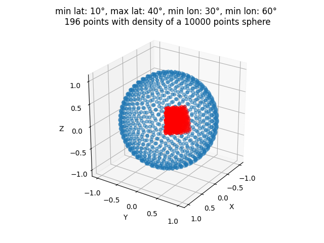
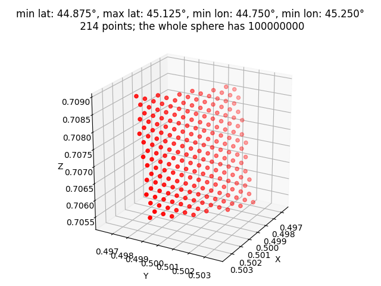

# fibonacci-sphere-section
Create a section of a fibonacci sphere efficiently.

If one wants to generate a fibonacci sphere with a large amount of points (for example ~50 million) but only needs a subset of these, removing by discarding can become very inefficient. This implmentation generates only those that are in the specified bounding box. It doesn't scale with the absolute number of points on the whole sphere but only with those that are contained in the boundinb box.

Here is a section of a sphere with 10,000 points, shown in red. The rest of the sphere is also shown in blue to make it apparent that this is a section. 

  

Here is another section with 100,000,000 points. The execution time is about the same.

  

